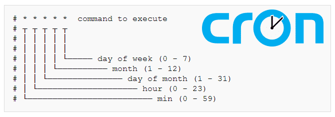

# Python Komut Dosyalarının Yürütülmesini Cron ile Otomatikleştirin




## Python Komut Dosyalarının Yürütülmesini Cron ile Otomatikleştirin

Python, cron kullanarak önceden programlanmış görevlerin otomatik olarak yürütülmesini planlamak için kullanılabilir. Ancak, bu tür Python betiklerinin yürütülmesini tam olarak nasıl otomatikleştireceğimize dalmadan önce, hızlıca cron ve Python'u tartışalım.
İçindekiler

* Python Hakkında
* Cron nedir?
* Bir Cron İşinin Bileşenleri
* Cron'un Altı Komut Alanı
* Bir Cron İşi Nasıl Oluşturulur
* Daha Karmaşık Veri Sorunları için Yardım
  
## Python Hakkında

Python, 1991'den beri var olan son derece popüler ve genel amaçlı bir bilgisayar kodlama ve programlama dilidir. Python'un ne olduğunu muhtemelen iyi bildiğiniz için bunu kısa tutacağız.

Python çok yönlüdür, birçok bilgisayar ve programlama platformuyla kullanım için uyumludur. Python; Mac, Windows, Raspberry Pi, Linux, Unix ve çok daha fazlasında kullanılabilir.

Python, çok çeşitli etkinlikler gerçekleştirebilir. Python'u yazılım ve web siteleri geliştirmek, karmaşık matematik işlemleri yapmak, sistem komut dosyası oluşturmak, web uygulamaları geliştirmek, büyük veri önbelleklerini işlemek, programların hızlı prototiplenmesini kolaylaştırmak ve çok daha fazlası için kullanabilirsiniz.

Python kodlama dili, İngilizce diline benzer, kullanıcı dostu ve basit bir sözdizimine sahiptir. Böylece yazılım geliştiriciler, Python'daki programları daha az kod satırı ve daha yüksek kullanım verimliliği ile kodlayabilirler. Ve Python, işlevsel, nesne yönelimli veya prosedürel bir şekilde ele alınabilir.

## Cron nedir?

Cron, ilk olarak 1977'de kavramsallaştırılan 'eski tarz' bir bilgisayar programlama dilidir. Cron, önceden belirlenmiş programlara göre tekrarlayan görev atamalarını programlamak için endüstri standardı bir koddur.

Cron, programlama dünyasında bir arka plan yardımcı programı için bir deyim olan bir 'arka plan programı'dır. Cron, bir bilgisayar programındaki etkinlikleri tekrarlayan, düzenli olarak programlanan veya tek seferlik görev olayları olarak planlamak için kullanılabilir.

Cron, otomatik olarak bir elektronik tablo oluşturmak veya toplu bir e-posta göndermek gibi görevleri, örneğin belirli ve önceden belirlenmiş saat ve tarihlerde zamanlamak için bir sisteme kolayca komut verebilir.

Cron sözdizimini çeşitli işletim sistemlerinde kullanabilirsiniz. macOS ortamlarına ek olarak Cron, “*nix” tabanlı bilgisayar sistemlerini (Unix, Linux vb.) çalıştırmak için kullanılan standart arka plan programıdır.

Cron mantığı ayrıca, Zuar'ın Runner veri boru hattı çözümü gibi işletim sistemi dışı yazılımlarda zamanlama için sıklıkla kullanılır. Runnner, cron programlamayı kullanarak diğer yazılımlardan veri çekme, verileri manipüle etme vb. birçok görevi otomatik hale getirebilir.

Cron arka plan programı işletmeler, büyük şirketler, üretim şirketleri ve bürokratik ofisler arasında çok popülerdir çünkü mevcut veritabanlarını değiştirmeyi, görevleri önceden belirlenmiş tarih ve saatlerde başlatmayı ve tekrar eden görevleri otomatik olarak programlamayı kolaylaştırır.

## Bir Cron İşinin Bileşenleri

Python bilgisayar betiklerinin otomatik olarak nasıl çalıştırılacağını daha iyi anlamak için cron bileşenlerini anlamamız gerekir:

* Sistemin yürüttüğü veya çağırdığı komut dosyası.
* Crontab, 'Cron Tablosu' teriminin kısaltılmış halidir. Çalıştırılacak cron zamanlamasını ve süreçleri ve fonksiyonları otomatikleştirmek için kullanılan komutları içeren bir dosyadır.
* Komut dosyasının eylemi/çıktısı.

## Cron'un Altı Komut Alanı

Bir cron işi için crontab'a veri girerken altı komut alanı kullanacaksınız:

* Bu girdi komut alanlarının ilk beşi, programa, belirttiğiniz tamsayılara (veya gereksiz alanları doldurmak için yıldızlara) göre programlanmış aktiviteyi ne zaman başlatacağını söyler.
* Altıncı alan, belirtilen zamanda çalışacak komutu belirttiğiniz yerdir.

Bağlam amacıyla, bir cron programındaki altı komut alanı şu şekilde görselleştirilebilir: * * * * * *

* İlk Komut Alanı: crontab komutunun tam olarak başlatıldığı dakika. Böylece 0 ile 59 arasında değişen sayılar girilmiş olacaktır.
* İkinci Komut Alanı: Komut başlatmanın tam saatine eşittir. Bu alandaki sayılar 0 ile 23 arasında değişir.
* Üçüncü Komut Alanı: komutun yürütüleceği ayın gününü girin. Yani, 1 ile 31 arasında bir sayı girersiniz.
* Dördüncü Komut Alanı: yılın ayını girin, böylece 1 ile 12 arasında bir sayı olur.
* Beşinci Komut Alanı: haftanın günlerinden birini temsil eden bir tamsayı girin. Sayılar 0'dan 6'ya kadardır; '0' Pazar'ı, '1' Pazartesi'yi vb. temsil eder.
* Beşinci Komut Alanı: cron işini başlatmak için komut sırası girilir.

Sistemin yok saymasını istediğiniz komut alanlarında yıldız işareti bulunmalıdır.

## örnek :
```
23 18 * * 2/mydir/myprogram
```
Bu crontab, bir cron işine her Salı 18:23'te yinelenen bir görevi yürütmesini söyler. Üçüncü ve dördüncü komut alanları, ayın gününü ve başlatma ayını temsil eder.

Bu size mantıklı geldiğinde, bu sözdizimini oluşturmanıza yardımcı olabilecek ücretsiz web araçlarını kullanarak zamandan ve beyin gücünden tasarruf edin.

Beş parçalı komut yerine bir anahtar sözcük kullanabileceğiniz özel durumlar vardır. Örneğin, mevcut işleri incelerken biraz daha sezgisel/açık olan bir kısayol olarak 0 0 * * * yerine @daily belirtebilirsiniz.

### Diğer seçenekler arasında : 
* @yearly    
* @monthly    
* @hourly
* @reboot (to launch a command when the system is booting)

# Bir Cron İşi Nasıl Oluşturulur

İlk önce, Python betiğinizi oluşturun. Ardından, çalıştığınız sistem terminalini açın.

Crontab'a erişmek için 'crontab -e' girin (zaten mevcut değilse bir tane oluşturulur). Ardından, düzenleme modunu başlatmak için 'i' girin ve program komutunuzu girmeye devam edin.

### İşte incelemeniz için örnek bir zamanlama komutu:

```
* * * * * cd/Users/user.name/Automation && /usr/bin/python test_cron.py
```

Düzenleme modundan çıkmak için 'ESC' sekmesine basın. Crontab'ınızı oluşturmak ve yazmak için ':wq' girin. Tüm crontab'ı silmeniz gerekirse, 'crontab -i' komutunu çalıştırın.

Tek bir cronjob'u silmeniz gerekiyorsa, 'crontab -e'yi çalıştırın, 'i'ye basın, ardından 'dd'ye basın ve dosyayı yazmak için ':wq'ye basın.

### örneği parçalayalım:

 * ```* * * * *``` – komut dosyasına her dakikalık bir programa göre çalışmasını söyleyen crontab komutu.
 * ```cd``` – crontab programına yürütülebilir dosyanın nerede bulunacağını söyleyen komutu temsil eder.
 * ```   /Users/user.name/Automation ``` – Python betiğinin nerede bulunabileceğini gösterir.
 * ``` & &```– betik komutunu ve betik adını ayırır.
 * ```/usr/bin/python``` – başlatılan Python betiğinin nerede olduğunu belirtir.
 * ```test_cron.py``` – komut dosyası için yalnızca örnek bir addır.

