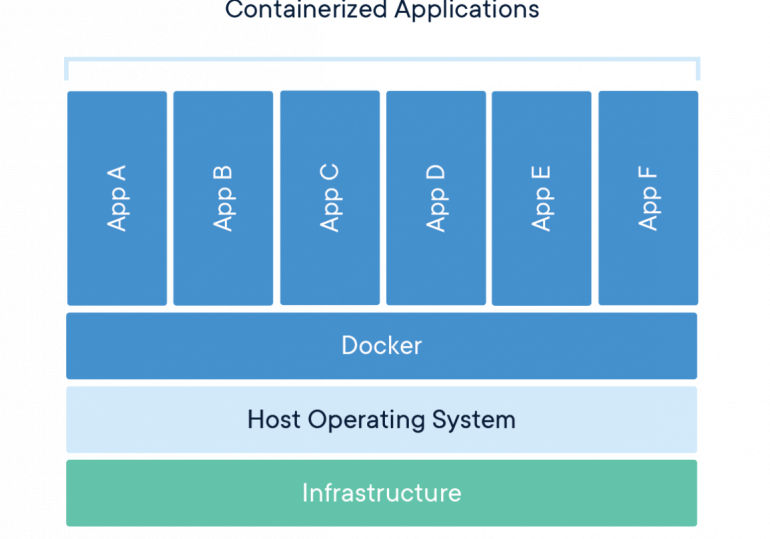
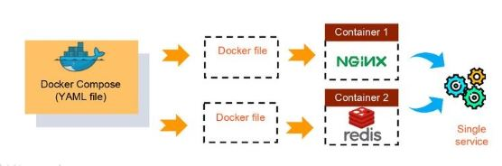
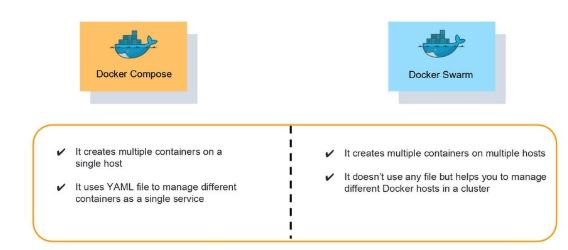
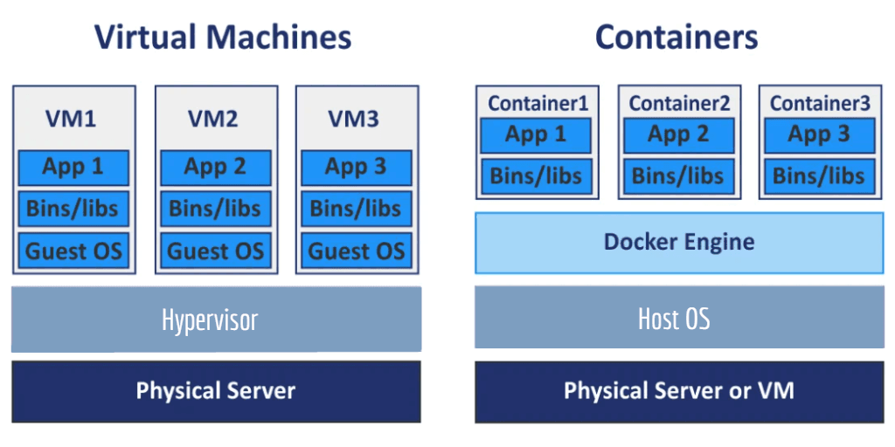
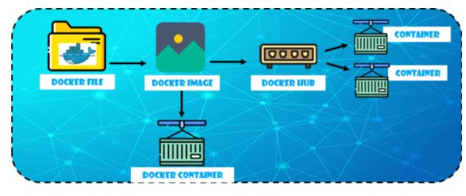
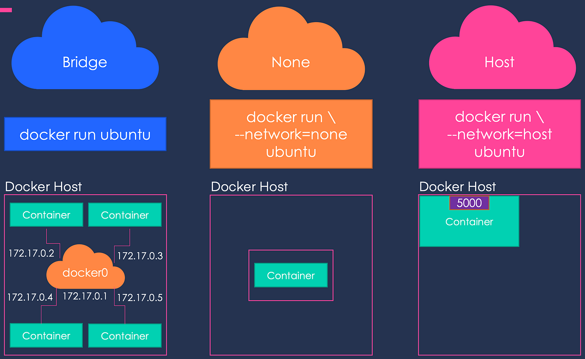

# Docker Nedir?
Docker, diğer sanal makinelerden farklı olarak, sanal işletim sistemini sıfırdan oluşturmak yerine, Linux çekirdeğinin paylaşımı ile birbirinden bağımsız şekilde sistemin kullanılmasını sağlar. Docker kullanmadan bir sistemin oluşturulması ekstra çaba gerektiren yorucu bir süreci kapsamaktadır. Yürütülecek tüm işlemler Docker ile birkaç saniyede gerçekleştirilmektedir. Docker hızlı kurulumu için resmi web sitesini buradan ziyaret edebilirsiniz. Docker, yazılım ve sistem için geliştirilmiş olan, açık kaynak özellikli bir sanallaştırma altyapısıdır. 

Docker’ın oluşturmuş olduğu platform ile Web sitelerinin kurulumları, testleri ve dağıtım işlemleri kolaylıkla gerçekleştirilmektedir. Docker’ın en önemli özelliği ise webmaster’ların da sıkça karşılaştığı “Mevcut bilgisayarda çalışıp, sunucuda çalışmama” sorunlarını tamamen ortadan kaldırılmasıdır. Docker sanallaştırma altyapısı, diğer sanal makinelerden (VirtualBox gibi) daha farklıdır ve içerisinde Hypervisor katmanını barındırmamaktadır. Bunların yerine, Docker Engine üzerinden işletim sistemine erişim sağlar ve sistem araçlarını paylaşımlı şekilde kullanır. Docker’ın en büyük avantajı ise çok daha az sistem kaynağı tüketimi sağlamasıdır.

# Docker Daemon:
Bir Linux çekirdeğinin içerisinde bulunan LXC yapısı mantığıyla çalışmaktadır. Docker Daemon’un amacı, konteynerların birbirinden izole olarak çalışmalarını yürütmelerine destek olmaktır.

Hypervisor’ün dockerdaki karşılığıdır. Bütün CPU ve RAM vb gibi işletim sistemine ait işlerin yapıldığı bölümdür.

# Container Nedir:
Basitçe söylemek gerekirse, kapsayıcı, makinenizde bulunan ve ana makinedeki diğer tüm işlemlerden izole edilmiş, korumalı alana alınmış bir işlemdir. Bu yalıtım, uzun süredir Linux'ta bulunan özellikler olan çekirdek ad alanlarını ve gruplarını kullanır. Docker, bu yetenekleri erişilebilir ve kullanımı kolay hale getirmek için çalıştı. Özetlemek gerekirse, bir konteyner:

* Bir görüntünün çalıştırılabilir bir örneğidir. DockerAPI veya CLI kullanarak bir kapsayıcı oluşturabilir, başlatabilir, durdurabilir, taşıyabilir veya silebilirsiniz.
* Yerel makinelerde, sanal makinelerde çalıştırılabilir veya buluta dağıtılabilir.
* Taşınabilirdir (herhangi bir işletim sisteminde çalıştırılabilir).
* Diğer konteynerlerden yalıtılmıştır ve kendi yazılımını, ikili dosyalarını ve yapılandırmalarını çalıştırır.




# Image Nedir:
Docker görüntüsü, Docker kapsayıcısında kod yürütmek için kullanılan bir dosyadır. Docker görüntüleri, bir şablon gibi bir Docker kapsayıcısı oluşturmak için bir dizi talimat görevi görür. Docker görüntüleri, Docker kullanılırken başlangıç noktası olarak da işlev görür. Görüntü, sanal makine (VM) ortamlarındaki anlık görüntüyle karşılaştırılabilir.

Docker, kapsayıcılarda uygulama oluşturmak, çalıştırmak ve dağıtmak için kullanılır. Bir Docker görüntüsü, bir uygulamanın çalışması için gereken uygulama kodunu, kitaplıkları, araçları, bağımlılıkları ve diğer dosyaları içerir. Bir kullanıcı bir görüntüyü çalıştırdığında, bir kapsayıcının bir veya birden çok örneği haline gelebilir.

Docker görüntüleri birden çok katmana sahiptir, her biri bir önceki katmandan kaynaklanır ancak ondan farklıdır. Katmanlar, yeniden kullanılabilirliği artırırken ve disk kullanımını azaltırken Docker yapılarını hızlandırır. Görüntü katmanları ayrıca salt okunur dosyalardır. Bir kap oluşturulduktan sonra, değiştirilemeyen görüntülerin üzerine yazılabilir bir katman eklenerek kullanıcının değişiklik yapmasına olanak sağlanır.

Docker görüntülerinde ve kapsayıcılarında disk alanına yapılan başvurular kafa karıştırıcı olabilir. Boyut ile sanal boyut arasında ayrım yapmak önemlidir. Boyut, bir kabın yazılabilir katmanının kullandığı disk alanını ifade ederken, sanal boyut, kapsayıcı ve yazılabilir katman için kullanılan disk alanıdır. Bir görüntünün salt okunur katmanları, aynı görüntüden başlatılan herhangi bir kapsayıcı arasında paylaşılabilir.

# Docker Registry:

Docker kayıt defteri, adlandırılmış Docker görüntüleri için bir depolama ve dağıtım sistemidir. Aynı görüntünün, etiketleriyle tanımlanan birden çok farklı sürümü olabilir.

Bir Docker kayıt defteri, bir havuzun belirli bir görüntünün tüm sürümlerini tuttuğu Docker havuzlarında düzenlenir. Kayıt defteri, Docker kullanıcılarının görüntüleri yerel olarak çekmesine ve ayrıca yeni görüntüleri kayıt defterine göndermesine olanak tanır (uygun olduğunda yeterli erişim izinleri verildiğinde).

Varsayılan olarak Docker motoru, Docker'ın genel kayıt örneği olan DockerHub ile etkileşime girer. Bununla birlikte, açık kaynaklı Docker kayıt defterini/dağıtımını ve ayrıca Docker Trusted Registry adlı ticari olarak desteklenen bir sürümü şirket içinde çalıştırmak mümkündür. Çevrimiçi olarak erişilebilen başka genel kayıtlar da vardır.

### Detaylı bilgi için: <a href="https://www.aquasec.com/cloud-native-academy/docker-container/docker-registry/">Docker Registry</a>

<br>

# Docker CLI Nedir:

Kullanıcının Docker Daemon ile konuşmasını sağlayan, docker komutlarının çalıştırıldığı CLI ekranıdır.


# Docker Genel Mimarisi


# Docker Compose Nedir?

Docker Compose, çoklu kapsayıcı uygulamaları tanımlamaya ve paylaşmaya yardımcı olan bir araçtır. Compose'u kullanarak, bir YAML dosyasındaki servisleri tanımlayabileceğimiz gibi, tek bir komutla döndürüp yıkabiliriz.

Docker Compose'u anlamak için örnek olarak Myntra'ya bakalım. Myntra, Amazon benzeri bir moda e-ticaret sitesidir. Web tarayıcınız aracılığıyla Myntra web sitesini ziyaret edersiniz ve hesabınıza giriş yapmak, bir kataloğa göz atmak, kontrol etmek vb. gibi çeşitli etkinliklerden geçersiniz. Bu etkinliklerin veya hizmetlerin her birinin arkasında, hesap veritabanı, ürün veritabanı, alışveriş sepeti veritabanı ve arka planda çalışan diğerleri gibi farklı ürünler bulunur.

Bunların her biri bir mikro hizmet olarak kabul edilebilir. Ortamınızda ne kadar çok mikro hizmet oluşturursanız, bu hizmetlerin her birine kendi kapsayıcılarında sahip olmak o kadar değerli olur. Ancak bir geliştirici olarak, bir kaptan diğerine atlayabilmeniz gerekir. Bu örneği, Docker Compose'un farklı kapsayıcıları tek bir hizmet olarak bağlayabildiği Docker ile ilişkilendirebileceğiniz yer burasıdır.

Docker Compose, birden çok kapsayıcıyı tek bir hizmet olarak çalıştırmak için kullanılır. Buradaki kapsayıcıların her biri yalıtılmış olarak çalışır ancak gerektiğinde birbirleriyle etkileşime girebilir. Docker Compose dosyalarının, Yet Another Markup Language anlamına gelen XML tabanlı bir dil olan YAML adlı bir betik dilinde yazılması çok kolaydır. Docker Compose ile ilgili bir başka harika şey de, kullanıcıların tek bir komut kullanarak tüm hizmetleri (kapsayıcıları) etkinleştirebilmesidir.

Örneğin:

NGINX sunucusu ve Redis veritabanı gerektiren bir uygulamanız varsa, her iki kapsayıcıyı da ayrı ayrı başlatmaya gerek kalmadan hizmet olarak çalıştırabilen bir Docker Compose dosyası oluşturabilirsiniz.




### Docker Compose'un Avantajları:
* Tek ana bilgisayar dağıtımı - Bu, her şeyi tek bir donanım üzerinde çalıştırabileceğiniz anlamına gelir.
* Hızlı ve kolay yapılandırma - YAML betikleri sayesinde
üksek üretkenlik - Docker Compose, görevleri gerçekleştirmek için gereken süreyi azaltır.
* Güvenlik - Tüm kapsayıcılar birbirinden izole edilmiştir, bu da tehdit ortamını azaltır   
  
Şimdi, Docker Compose'un Docker Swarm'a oldukça benzediğini düşünebilirsiniz, ancak durum bu değil. Docker Compose ve Docker Swarm arasındaki farklardan bazıları şunlardır:




## Docker Compose'daki Temel Komutlar:
* Start all services:
```
Docker Compose up
```

* Stop all services:
```
Docker Compose down
```
* Install Docker Compose using pip: 
```
pip install -U Docker-compose
```
* Check the version of Docker Compose: 
```
Docker-compose-v
```
* Run Docker Compose file: 
```
Docker-compose up -d
```
* List the entire process: 
```
Docker ps
```
* Use YAML files to configure application services - Docker Compose.yml

Example :
```
version: '3'
services:
  app:
    image: node:latest
    container_name: app_main
    restart: always
    command: sh -c "yarn install && yarn start"
    ports:
      - 8000:8000
    working_dir: /app
    volumes:
      - ./:/app
    environment:
      MYSQL_HOST: localhost
      MYSQL_USER: root
      MYSQL_PASSWORD: 
      MYSQL_DB: test
  mongo:
    image: mongo
    container_name: app_mongo
    restart: always
    ports:
      - 27017:27017
    volumes:
      - ~/mongo:/data/db
volumes:
  mongodb:
```

# Docker ve VM arasındaki farklar:

### Docker
* OS : Küçültülmüş işletim sistemi imajı
* İzolasyon : Daha düşük
* Çalışır hale gelmesi : Saniyeler
* Versiyonlama : Yüksek
* Kolay paylaşılabilirlik : Yüksek

### VM (Virtual Machine)

* OS : Tam işletim sistemi
* İzolasyon : Yüksek
* Çalışır hale gelmesi : Dakikalar
* Versiyonlama : Yok
* Kolay paylaşılabilirlik : Düşük




# Docker komutları:

1. docker --version 
* Bu komut, halihazırda yüklü olan docker sürümünü almak için kullanılır.
```
docker --version
```


2. docker pull 
* Bu komut, docker deposundan (hub.docker.com) görüntüleri çekmek için kullanılır.

```
docker pull redis
```


3. docker run 
Bu komut, bir görüntüden bir container oluşturmak için kullanılır.

-it : terminal keyboardInteractive

-d : detached mod
```
docker run -it -d redis
```


4. docker ps 
Çalışan container listeler
```
docker ps
```


5. docker ps -a

Duran ve çalışan containerları listeler.
```
docker ps -a
```


6. docker exec

docker exec -it container_id bash

Bu komut, çalışan kapsayıcıya erişmek için kullanılır.

```
docker exec -it 3fa bash
```


7. docker stop

docker stop container_id

Bu komut çalışan bir konteyneri durdurur.
``` 
docker stop 2df 
```


8. docker kill

Bu komut, yürütmesini hemen durdurarak kabı öldürür. "docker kill" ve "docker stop" arasındaki fark, "docker stop"un konteynere zarif bir şekilde kapanması için zaman vermesidir, konteynerin durdurulmasının çok fazla zaman aldığı durumlarda, kişi onu öldürmeyi seçebilir.

docker kill container_id

```
docker kill 2df
```

9. docker commit
Bu komut, yerel sistemde düzenlenmiş bir containerın yeni bir görüntüsünü oluşturur.

```
docker commit conatainer_id username/imagename
```

9. docker login

Bu komut, docker hub deposunda oturum açmak için kullanılır.

```
docker login
```

10. docker push 

Bu komut, bir image docker hub deposuna göndermek için kullanılır.

docker push username/image_name
```
docker push mhmmd/redis
```

11. docker rm 

Bu komut durdurulan bir container silmek için kullanılır.

docker rm container_id

```
docker rm 35f
```

12. docker rmi

Bu komut, bir image yerel depolamadan silmek için kullanılır.

docker rmi image_id

```
docker rmi 25a
```

13. docker build
 
Bu komut, belirtilen bir docker dosyasından bir image oluşturmak için kullanılır.

docker build path to docker file

```
docker build .
``` 

### Daha fazla komut bilgisi için şu komutu kullanabilirsiniz.
```
docker --help
````


# Docker Network nedir:

Docker ağı, bir kullanıcının bir Docker kapsayıcısını ihtiyaç duyduğu kadar çok ağa bağlamasını sağlar. Docker Ağları, Docker konteynerleri için tam izolasyon sağlamak için kullanılır.

Not: Bir kullanıcı birden fazla ağa kapsayıcı ekleyebilir.

Devam edelim ve ağ oluşturmanın Avantajlarına bakalım.

Docker Networking'in Avantajları

Docker Networking kullanmanın başlıca avantajlarından bazıları şunlardır:

* Tek bir işletim sistemini paylaşırlar ve caontainer'ları yalıtılmış bir ortamda tutarlar.
* İş yükünü çalıştırmak için daha az işletim sistemi örneği gerektirir.
* Yazılımın hızlı bir şekilde teslim edilmesine yardımcı olur.
* Uygulama taşınabilirliğine yardımcı olur.

# Docker Network nasıl çalışır:

Daha derinlemesine bir anlayış için Docker Networking'in nasıl çalıştığına bir göz atalım. Aşağıda, Docker Networking iş akışının şematik bir temsili yer almaktadır:



### Docker Dosyası, Docker image oluşturur.
* Docker Image, Docker Konteynerleri oluşturmak için kullanılan talimatları içeren bir şablondur.
* Docker, kullanıcıların kapsayıcı görüntülerini depoladığı ve dağıttığı 
* Docker Hub adlı kendi bulut tabanlı kayıt defterine sahiptir.
* Docker Container, bir uygulamanın ve bağımlılıklarının birlikte yürütülebilir bir paketidir.

Farklı bileşenlerin işlevleri:

* Docker File, build komutunu kullanarak bir Docker Image oluşturma sorumluluğuna sahiptir.

### Docker Image, projenin tüm kodunu içerir.


### Docker Image kullanarak, herhangi bir kullanıcı Docker Konteynerleri oluşturmak için kodu çalıştırabilir.


Docker Image oluşturulduktan sonra, bir registry veya bir Docker Hub'a yüklenir.

# Network Drivers

Docker, ağ sürücüleri aracılığıyla kapsayıcıları için ağ oluşturmayı destekler. Bu sürücülerin birkaç ağ sürücüsü vardır.

Bu yazıda, kapsayıcılarınızı uygun ağ sürücüleri ile nasıl bağlayacağınızı tartışacağız. Docker'da kullanılan ağ sürücüleri aşağıdadır:

* Bridge
* Host
* None
* Overlay
* Macvlan

### Bridge

* Ana bilgisayarda oluşturulan özel bir varsayılan ağdır. Bu ağa bağlı konteynerler, birbirleriyle kolayca iletişim kurabilecekleri dahili bir IP adresine sahiptir.
* Docker sunucusu (arka plan programı), paketleri çeşitli ağ arabirimleri arasında dağıtarak otomatik olarak çalışan bir sanal ethernet köprüsü docker oluşturur.
* Bunlar, uygulamalar bağımsız bir kapsayıcıda yürütüldüğünde yaygın olarak kullanılır.

### Host

* Bu bir genel ağdır
* Kapsayıcı içinde çalışan hizmetleri görüntülemek için ana bilgisayarın IP adresini ve TCP bağlantı noktası alanını kullanır.
* Liman işçisi ana bilgisayarı ile liman işçisi konteynerleri arasındaki ağ izolasyonunu etkili bir şekilde devre dışı bırakır; bu, bu ağ sürücüsünü kullanan bir kullanıcının aynı ana bilgisayarda birden fazla konteyner çalıştıramayacağı anlamına gelir.

### None


* Bu ağ sürücüsünde, Docker kapsayıcılarının harici ağlara erişimi olmayacak ve diğer kapsayıcılarla iletişim kuramayacak.
* Bu seçenek, bir kullanıcı bir kapsayıcıya ağ erişimini devre dışı bırakmak istediğinde kullanılır.
* Basit bir ifadeyle, Hiçbiri geri döngü arabirimi olarak adlandırılır, yani harici ağ arabirimleri yoktur.

### Overlay

* Bu, Docker sürü kümesindeki Docker düğümlerine dahili bir özel ağ oluşturmak için kullanılır.
* Not: Docker Swarm, geliştirici ekiplerin Docker platformu içinde sürü düğümleri kümesi oluşturmasını ve yönetmesini kolaylaştıran bir konteyner hizmetidir.
* Docker ağında önemli bir ağ sürücüsüdür. Bağımsız kapsayıcı ile Docker sürü hizmeti arasındaki etkileşimin sağlanmasına yardımcı olur.

### Macvlan

* Konteynerler arasındaki iletişim sürecini basitleştirir
* Bu ağ, Docker kapsayıcısına bir MAC adresi atar. Bu Mac adresiyle, Docker sunucusu (arka plan programı) ağ trafiğini bir yönlendiriciye yönlendirir
* Not: Docker Daemon, işletim sistemi ile etkileşime giren ve her türlü hizmeti gerçekleştiren bir sunucudur.
* Bir kullanıcı, konteyneri Docker ana bilgisayarı yerine doğrudan fiziksel ağa bağlamak istediğinde uygundur.




# Docker temel networking komutları

* Docker ile ilişkili Ağları listeler.
* Docker ekosisteminde bulunan tüm ağları görüntüler.
```
docker network ls 
```

* Çalışan Bir Konteyneri Bir Ağa Bağlar.
```
docker network connect multi-host-network container
 ```
 *Container atamak istediğiniz IP Adresini belirtin.
 ```
 docker network connect --IP 10.10.36.122 multi-host-network container
 ```

 * Bir Konteyner için Ağ takma adı oluşturun
 *  yeni komutları tanımlamak ve yanlış girişi düzeltmek için Takma Adlar belirleyin.
```
docker network connect --alias db --alias mysql multi-host-network container2
```

* Bir Konteynerin Ağla Bağlantısını Kesme
* Aşağıdaki komutta, birden çok ana bilgisayar ağında çalışan docker kapsayıcılarını durdurmak için bağlantı kesme seçeneği kullanılır.
```
docker network disconnect multi-host-network container1
```

* Bir network silme
* Aşağıdaki komutta, bir ağı Docker ekosisteminden kaldırmak için rm seçeneği kullanılır.

```
docker network rm network_name
```

* Birden Çok Ağı Kaldırma.
* Aşağıdaki komut, bir kullanıcı aynı anda birden fazla ağı kaldırmak istediğinde kullanılabilir.  
```
 docker network rm 3695c422697f network_name
```

* Tüm Kullanılmayan Ağları Kaldır
* AŞağıdaki 'prune' komutu, bir kullanıcı kullanılmayan tüm ağları tek seferde kaldırmak istediğinde kullanılabilir.
```
docker network prune
```

